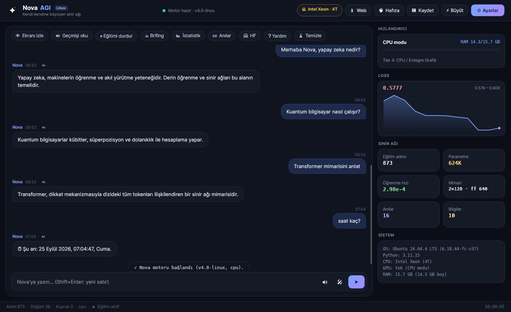

<div align="right">
  <strong>Diller:</strong> <a href="README.md">English</a> | <b>Türkçe</b>
</div>

<div align="center">


# Nova AGI — Linux Sürümü

*Hafızası, sesi, ekran farkındalığı ve yerel masaüstü uygulaması olan, kendi kendine büyüyen sinir ağı.*

[](#hızlı-başlangıç)
[](https://www.python.org/)
[](https://pytorch.org/)
[](https://avaloniaui.net/)
[](LICENSE)



</div>

> [!NOTE]
> **Proje durumu: rafa kaldırıldı.** *"Yapay zeka eğitilebilir, sadece elimde yeterince kaynak yok."*
> Nova çalışan bir prototiptir; mimari, büyüme, hafıza ve arayüzlerin hepsi çalışır. Ancak sıfırdan
> kullanışlı bir dil modeli eğitmek bir masaüstü bilgisayarın çok ötesinde işlem gücü ister. Eğitilmemiş
> model anlamsız metin üretir; araç yanıtları (Wikipedia, hesap makinesi, saat, ekran analizi…) hemen çalışır.

Bu dal, **`windows-part` dalının Linux'a çevrilmiş hâlidir**: Windows'a özgü tüm parçalar (WPF,
DirectML, `winreg`, `winsound`, GDI, Windows OCR, `.bat` betikleri, Inno Setup) Linux karşılıklarıyla
değiştirildi ve bu sırada kod optimize edildi.

## Hızlı başlangıç

```bash
git clone -b claude-verison https://github.com/lonlyexe0/NovaAGI.git
cd NovaAGI
./install.sh          # sistem paketleri, Python ortamı, doğru PyTorch, masaüstü uygulaması, menü girdisi
./nova.sh             # başlat
```

`install.sh` GPU'nuzu algılayıp uygun PyTorch derlemesini kurar. Zorlamak için
`--gpu=cuda|rocm|xpu|cpu` kullanın. Diğer seçenekler: `--no-system` (sudo yok), `--no-desktop`,
`--with-dotnet` (modern arayüz için .NET SDK'yı `~/.dotnet` altına kurar), `-y`.

**Hafif kurulum.** PyTorch parça parça kurulamaz. Bu yüzden `install.sh`, Nova'nın çalışırken hiç
kullanmadığı kısımları siler: C++ test ikilileri, başlık ve CMake dosyaları (~200 MB). pip önbelleği
de tutulmaz. Ağır isteğe bağlı gruplar varsayılan olarak kurulmaz: `vision` (OpenCV), `data`
(Hugging Face `datasets`) ve `export` (ONNX). Gerekirse `--extras=vision,data,export` veya `--full`
ile ekleyin. CPU kurulumu ~1.5 GB'tan ~870 MB'a iner. `torch.compile` veya C++ eklentisi
gerekiyorsa `--keep-torch-dev` kullanın.

| Komut | Görevi |
|---|---|
| `./nova.sh` | Avalonia masaüstü uygulaması (.NET yoksa Tk arayüzü) |
| `./nova.sh term` | Terminal sohbeti (`main.py`) |
| `./nova.sh launcher` | Hugging Face akışlı gelişmiş terminal başlatıcı |
| `./nova.sh web` | Web/telefon sunucusu, erişim adresini yazdırır |
| `./nova.sh tunnel` | Web sunucusunu Cloudflare tüneliyle internete açar |
| `./nova.sh doctor` | GPU, araç ve Python paketi kontrolü |
| `./nova.sh build` | Masaüstü uygulamasını yeniden derler |
| `./uninstall.sh` | Menü girdisini, derlemeleri ve (isteğe bağlı) verileri kaldırır |

## Windows sürümünden farklar

**Platform**
- **Masaüstü arayüzü:** WPF → **Avalonia 11** (.NET 9). Yeniden tasarlanmış koyu tema, akışlı sohbet,
  telemetri kartları, loss grafiği ve yakınlaştırılıp kaydırılabilen kuvvet yönlendirmeli hafıza
  grafiği. Grafik binlerce UI öğesi yerine tek geçişte çizilir.
- **GPU:** DirectML → **CUDA, ROCm (AMD) ve XPU (Intel Arc)**. ROCm'un resmi listesinde olmayan Radeon
  kartlar (ör. RX 6500 XT / RX 7600) için `HSA_OVERRIDE_GFX_VERSION` otomatik ayarlanır.
- **Donanım algılama:** registry → `/proc`, `/sys/class/drm`, `nvidia-smi`, `lspci`. Sonuç
  önbelleklenir, telemetri sorgusu ucuzdur.
- **Ses:** winsound/MCI → PipeWire, PulseAudio, ALSA, ffplay veya mpv. Çevrimdışı TTS yedeği: **espeak-ng**.
- **Ekran ve OCR:** GDI/Windows OCR → `mss` (X11), Pillow, `grim`, `gnome-screenshot`, `spectacle` ve
  **Tesseract**.
- **Sistem eylemleri:** `user32` tuş olayları → `loginctl`, `wpctl`/`pactl`/`amixer`,
  `wmctrl`/`xdotool` ve masaüstünüzün sistem izleyicisi.
- **Betikler ve paketleme:** `.bat`/Inno Setup → `install.sh`, `nova.sh`, `.desktop` girdisi ve
  `packaging/build_release.sh`.
- **Veriler** `~/.local/share/nova-agi` altında (XDG) tutulur. Değiştirmek için `NOVA_DATA_DIR` kullanın.

**Hız**
- Metin üretimi **KV-cache** ve vektörize örnekleme kullanır. Eskiden her token için tüm bağlam yeniden
  hesaplanıyor ve Python döngüsü çalışıyordu.
- Dikkat katmanı **`scaled_dot_product_attention`** ile çalışır (Flash / bellek-verimli çekirdekler).
  CUDA'da fused AdamW kullanılır.
- Eğitim, kuyruktaki **tüm** kayıtlardan pencere örnekler. Eskiden yalnızca ilk belge öğreniliyor ama
  40 kaydın hepsi "işlendi" sayılıyordu.
- SQLite: kaynak URL indeksi sayesinde veritabanı büyüdükçe içe aktarma yavaşlamıyor. Ayrıca SQL içinde
  RAG ön-filtresi, toplu güncelleme ve tek sorguluk istatistik var. Hafıza grafiği verisi kısaltılır;
  artık her yenilemede MB'larca JSON gönderilmez.

**Düzeltmeler**
- Embedding büyümesi artık Q/K/V ağırlıklarını karıştırmıyor; network morphism Q/K/V için gerçekten
  işlevi koruyor.
- Masaüstü köprüsünün stdout'u **yalnızca protokol** içindir. Önceden araya giren `print()` çıktıları
  JSON akışını bozuyordu.
- Arayüz kapanınca motor ağırlıkları kaydedip çıkar. Önceden kapanan stdin üzerinde sonsuza dek dönüyordu.
- Yavaş işlemler (ekran izleme, dışa aktarma, dinleme) köprüyü kilitlemek yerine iş parçacığı havuzunda
  çalışır.
- Arayüzden gelen eşzamanlı yazmalar sıraya alınır.
- Ayarlar üzerine yazılmak yerine birleştirilir; cihaz ayarı artık gerçekten uygulanır.
- Hesap makinesi `eval` yerine güvenli AST değerlendiricisi kullanır. `!python` artık `sys.stdout`'u ele
  geçirmez.
- Web sunucusu **erişim anahtarı** ister. Önceden aynı Wi-Fi'deki herkes kod çalıştırabilir veya
  ekranınızı görebilirdi. Sunucu ayrıca statik dosyaları `web/` klasöründen sunar, yanıtları akışla
  (NDJSON) gönderir ve istek boyutunu sınırlar.
- Ünlü birinin sesini klonlamak için kullanılan örnek kayıtlar ve XTTS betikleri kaldırıldı. Nova artık
  standart nöral sesler kullanır (`en-IE-EmilyNeural`, `tr-TR-EmelNeural`).

## Telefon ve web erişimi

**Ayarlar → Mobil & Web** bölümünden açın (veya `./nova.sh web`). Uygulama
`http://192.168.1.20:8080/?token=…` gibi bir adres gösterir. Aynı Wi-Fi'deki cihazda açın; uygulama
gibi kullanmak için **Ana Ekrana Ekle**'ye dokunun. Anahtar ilk ziyarette cihaza kaydedilir. İnternet
üzerinden erişim için `./nova.sh tunnel` çalıştırın ve `trycloudflare.com` adresinin sonuna `?token=…`
ekleyin.

## Sohbet komutları

`!yardim` hepsini listeler. Öne çıkanlar: `!istatistik`, `!egitim durdur|baslat`, `!wiki <konu>`,
`!ara <sorgu>`, `!hesapla 2^10+sqrt(144)`, `!python <kod>`, `!oku <dosya>`, `!izle` (ekran analizi),
`!brifing`, `!anilar 5`, `!kaydet`, `!buyut`, `!hf <token>`, `!lang en|tr`.

## Masaüstü uyumluluk tablosu

| Özellik | X11 | Wayland |
|---|---|---|
| Sohbet, ses, hafıza, eğitim, web | ✅ | ✅ |
| Ekran izleme / görüntü alma | ✅ `mss` | ✅ `grim` (wlroots), `gnome-screenshot`, `spectacle` |
| Fare ve klavye kontrolü (`pyautogui`) | ✅ | Yalnızca XWayland pencereleri |
| Aktif pencere başlığı, "masaüstünü göster" | ✅ `xdotool` / `wmctrl` | — |

## Proje yapısı

```
nova_engine.py      çekirdek motor: sohbet akışı, ! komutları, telemetri, ayarlar
nova_bridge.py      masaüstü uygulaması için JSON-lines IPC (stdout = yalnızca protokol)
brain.py            kendi kendine büyüyen transformer (KV-cache, SDPA, network morphism)
memory.py           SQLite epizodik + semantik hafıza, RAG, grafik verisi
body.py             ajan bedeni: web tarayıcı, ses, görüntü, yetenekler
linux_desktop.py    Linux'ta ses / ekran görüntüsü / sistem eylemleri
hardware.py         CPU/GPU/RAM algılama ve eğitim profili
gpu_setup.py        CUDA · ROCm · XPU · CPU hazırlığı (torch'tan önce çalışır)
web_server.py       REST API + web uygulaması (web/)
NovaApp/            Avalonia masaüstü uygulaması (C#)
main.py · nova_launcher.py · gui.py   terminal REPL, başlatıcı, yedek Tk arayüzü
nova_headless_trainer/                bulut/Colab eğiticisi
```

## Sorun giderme

- **AMD GPU kullanılmıyor:** `./nova.sh doctor` çalıştırın. ROCm PyTorch derlemesi
  (`./install.sh --gpu=rocm`) gerekir ve kullanıcınız `render` ile `video` gruplarında olmalıdır.
- **Mikrofon çalışmıyor:** `pyaudio` için `portaudio19-dev` (Debian/Ubuntu) veya `portaudio-devel`
  (Fedora) gerekir.
- **Ses çıkmıyor:** `espeak-ng` kurun (çevrimdışı) veya internet bağlantınızı kontrol edin (edge-tts).
- **Masaüstü uygulaması açılmıyor:** `./install.sh --with-dotnet` ile derleyin. `./nova.sh tk` her zaman
  çalışır.

## Lisans

GPL-3.0. Ayrıntılar için [LICENSE](LICENSE) dosyasına bakın.
